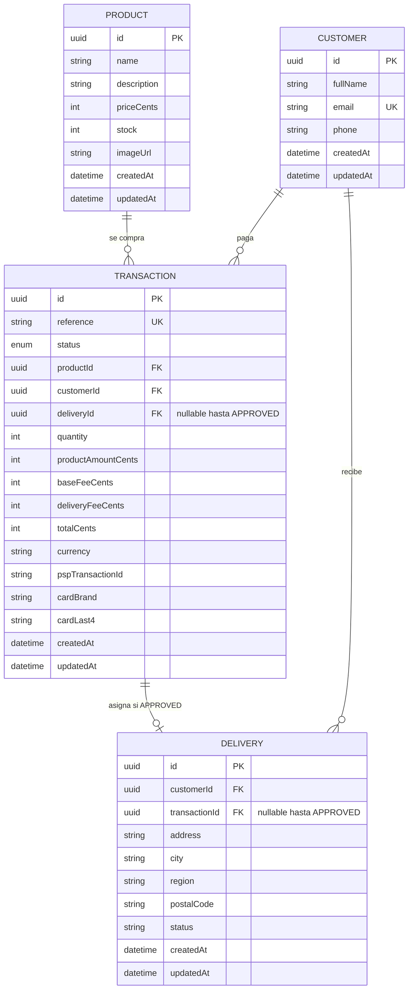

# Modelo de datos

Cuatro entidades de negocio que pide la kata: **producto**, **cliente**, **transacción** y **entrega**. Fuente de verdad: `apps/api/prisma/schema.prisma` (PostgreSQL, UUID, montos en **centavos enteros COP**). Local: Compose. AWS: RDS.

El token de tarjeta y los tokens de aceptación **no** son tablas. Viven en el request de pago y se descartan.

## Diagrama



Tablas Prisma: `products`, `customers`, `transactions`, `deliveries`. `Transaction.status` es el enum `PENDING | APPROVED | DECLINED | ERROR`.

Hay **dos FKs** entre transacción y entrega:

- `deliveries.transactionId` — la dirección “pertenece” a esa compra (se rellena al asignar).
- `transactions.deliveryId` — la transacción apunta a la entrega **solo** en `APPROVED` (única).

## Entidades

### Product

Catálogo dummy. **No** hay `POST /products`. El seed (`apps/api/prisma/seed.ts`) upserta dos ítems:

| Nombre | `priceCents` | `stock` inicial |
|---|---|---|
| Auriculares inalámbricos | 12_990_000 | 8 |
| Teclado mecánico | 24_990_000 | 4 |

Fotos en `apps/web/public/products/` (`imageUrl` tipo `/products/headphones.jpg`).

| Campo | Notas |
|---|---|
| `priceCents` | Precio unitario. El total de línea se calcula en servidor (`quantity * priceCents`). |
| `stock` | Unidades disponibles. Al crear `PENDING` se **reserva**; al `APPROVED` se confirma el descuento; al `DECLINED` / timeout se **libera**. |

### Customer

Quién compra. `email` es único. No es un usuario autenticado: se persiste para la entrega y para recuperar progreso tras un refresh (`GET /customers/:id`).

### Delivery

Dirección de envío. Se captura **antes** del cobro (junto con la tarjeta, en el modal) con `status = draft`. La **asignación** (`status = assigned`, `transaction.deliveryId` + `delivery.transactionId`) ocurre **solo** si el PSP responde `APPROVED`. Si el pago falla, la fila de dirección puede existir; no hay entrega que cumplir.

### Transaction (pago)

Máquina de estados. `reference` es nuestra idempotencia hacia el PSP (única, ≤ 255 chars). `currency` default `COP`.

| `status` | Significa |
|---|---|
| `PENDING` | Creada; stock reservado; cobro aún no terminal |
| `APPROVED` | PSP aprobó; stock confirmado; entrega asignada |
| `DECLINED` | PSP rechazó; stock liberado; sin entrega |
| `ERROR` | Timeout / error de infraestructura; reintentable sin doble cobro |

Fees fijos en servidor (`apps/api/src/domain/checkout.ts`); el front no los manda como fuente de verdad:

- **Base fee:** `500_000` centavos (siempre).
- **Delivery fee:** `800_000` centavos (siempre en este checkout).

`totalCents = productAmountCents + baseFeeCents + deliveryFeeCents`. Eso es lo que se firma y se envía al PSP como `amount_in_cents`.

## Qué no se guarda (PCI)

| Dato | Dónde vive | ¿En Postgres? |
|---|---|---|
| PAN, CVC, fecha de expiración | Solo el browser, el tiempo de tokenizar | **No** |
| Token de tarjeta (`tok_…`) | Request de `POST …/pay`; se reenvía al PSP | **No** (uso único) |
| Token de aceptación de términos | SPA lo pide al PSP (`GET merchants` + llave pública) y lo manda en `pay` | **No** |
| Token de autorización de datos personales | Igual, si el sandbox lo exige | **No** |
| Firma de integridad | La calcula la API en el momento del cobro (`SHA256(reference + amount_in_cents + COP + integrity_secret)`) | **No** |
| `cardBrand`, `cardLast4` | Respuesta de tokenización / cargo | Sí, para el recibo |

Redux / `localStorage` pueden guardar paso, `productId`, `quantity`, datos de entrega, `transactionId`. **Nunca** PAN, CVC ni el token de tarjeta.

## Flujo sandbox (PSP) vs nuestras tablas

Alineado con el flujo típico de un PSP colombiano en sandbox (tokens de aceptación → tokenizar tarjeta → crear transacción). En el código público el proveedor se llama **PSP**, no por marca.

```
SPA                         API                         PSP sandbox
│                           │                           │
│ GET merchants (pub key)   │                           │
│ acceptance_token ─────────┼──────────────────────────►│
│                           │                           │
│ POST tokens/cards (pub)   │                           │
│ tok_… ────────────────────┼──────────────────────────►│
│                           │                           │
│ POST /transactions        │ INSERT PENDING            │
│                           │ reserve stock             │
│                           │                           │
│ POST /transactions/:id/pay│                           │
│  { paymentToken,          │ POST /transactions (priv) │
│    acceptanceToken }      │ reference + signature     │
│                           │ poll GET /transactions/id │
│                           │ UPDATE APPROVED/DECLINED  │
```

Nuestra `TRANSACTION.pspTransactionId` es el id que devuelve el sandbox, no el PAN. Nuestra `reference` es la que el PSP exige única.

## Invariantes

1. `stock` nunca queda negativo.
2. `totalCents` se recalcula en servidor; un total manipulado en el client se ignora.
3. Una `reference` no se cobra dos veces.
4. `deliveryId` en la transacción solo se setea en `APPROVED`.
5. No hay fila de “card”. No hay columna `pan`.
